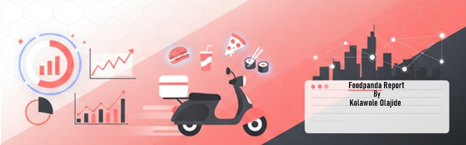

# 🍽️ Foodpanda Data Analysis Dashboard

### 📊 Data Analysis | Excel • Power BI • PowerPoint

---

## 🧠 Project Overview

This project analyzes **Foodpanda’s customer and delivery data** to uncover insights that improve delivery efficiency, customer satisfaction, and loyalty performance.  
The goal is to understand order patterns, delivery performance, and customer behavior using a clean, interactive dashboard.

---

## 🗂️ Dataset Information

**Dataset Columns:**  
`customer_id`, `gender`, `age`, `city`, `signup_date`, `order_id`, `order_date`,  
`restaurant_name`, `dish_name`, `category`, `quantity`, `price`, `payment_method`,  
`order_frequency`, `last_order_date`, `loyalty_points`, `churned`,  
`rating`, `rating_date`, `delivery_status`.

---

## ⚙️ Tools Used

- **Microsoft Excel** – Data cleaning and preparation  
- **Power BI** – Data modeling, DAX calculations, and dashboard design  
- **PowerPoint** – Custom design for dashboard background and presentation  

---

## 📈 Key Metrics

| Metric                           | Description                                                            |
| -------------------------------- | ---------------------------------------------------------------------- |
| 🚚 **On-Time Delivery Rate**     | 34.33% of orders were delivered on time, while 65.67% were delayed.    |
| 💰 **Average Order Value (AOV)** | Measures average spending per order to understand purchasing behavior. |
| 👥 **Customer Churn Rate**       | Tracks the percentage of customers who stopped ordering.               |
| 🍔 **Top-Selling Category**      | Identifies which food categories have the highest order volume.        |
| 🌆 **City-wise Performance**     | Compares order volume and on-time delivery rate across locations.      |

---

## 💡 Insights

1. **Only 34.33% of orders were delivered on time**, while **65.67% were delayed**, revealing major delivery inefficiencies.  
2. **Delayed deliveries (65.67%) received an average rating of 3.3**, slightly higher than **on-time deliveries (3.0)** — suggesting customers may rate based on other factors like food quality.  
3. **Certain cities recorded better performance**, both in delivery efficiency and customer retention.  
4. **Top 3 food categories** generated the majority of revenue and orders.  
5. **High churn rate among low-frequency customers**, indicating the need for stronger retention strategies.  

---
## Reconmmendation
💡 Strategic Actions
- Enhance Delivery Logistics: Improve dispatch routes and reduce late orders.
- Loyalty Optimization: Offer extra points to frequent customers to reduce churn.
- Promote Underrated Categories: Boost low-selling but high-rated items (e.g., Desserts).
- Target High-Value Segments: Focus marketing on 25–34 age group and top-spending cities.
- Monitor KPIs Continuously: Automate tracking in Power BI for monthly business review.
- Final Insight: Data-driven improvements can enhance customer satisfaction, loyalty, and Foodpanda’s overall growth.
---

## 🧭 Dashboard Preview

---

## 🗂️ Project Files

| File                                   | Description                                      |
| -------------------------------------- | ------------------------------------------------ |
| `Foodpanda background.png`             | Dashboard Background Design                      |
| `foodpanda_dashboard.pbix`             | Power BI Dashboard File                          |
| `foodpandacleaned Dataset.xlsx`        | Excele Cleaned Dataset File                      |
| `fooodpanda1.png`                      | Dashboard screenshot                             |
| `fooodpanda2.png`                      | Dashboard screenshot                             |
| `fooodpanda3.png`                      | Dashboard screenshot                             |
| `Github_banner`                        | Repo Github Banner                               |

---

## 🙌 Author

**Kolawole Olajide**  
💼 *Data Analyst | Excel | Power BI | Storytelling with Data*  
🔗 [LinkedIn](www.linkedin.com/in/kolawole-olajide)  
---

## ⭐ Acknowledgments
Thanks to Josh and the management team for providing the dataset and guidance during analysis.  
If you find this project helpful, consider giving it a ⭐ on GitHub!

